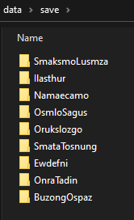

# Dwarf Fortress World Generation Manager
This is a Windows Batch script for generating multiple custom Dwarf Fortress worlds automatically. As worlds are generated, it renames their region folder to their in-game world-name, organizes the info/map files into their corresponding world's folder, and outputs a log file with a list of all worlds generated that session, with their age, populations, and tower info.

### USAGE
Place the `GenerateWorlds.bat` file into your DF game folder (where `Dwarf Fortress.exe` is), without the game present this script does nothing.

Next, either choose one of the preexisting generator presets found in your `world_gen.txt` file, or create your own custom one using the "Design New World with Advanced Parameters" in the game's main menu.

After that, you can run `GenerateWorlds.bat`, it will ask you to enter the preset title you want (spelling/capitalization must be exact), and how many worlds you want it to generate. Just make sure your computer has enough space for the number you give it. It'll then load up the game window and start generating. (Note: Depending on your gen settings and computer, this process may take a long time.)
It should do everything automatically at that point, although the DF game window will occasionally pop up during the process, so you may want to go afk or do something else while it works.

Once it's finished you can either check each world's info folder to help narrow down which worlds you want to keep, or check the GenLog file which this script will create as worlds generate. If you want further Legends information you will need to start the game in Legends mode, and export those files the normal manual way, for now. Eventually I hope to have this script automatically output those legends files, but that will require a custom dfhack script. For now this bat script does not require dfhack in your game, it will work fine without.

### Example Output
Here's an example of what your world folders will look like, after being generated by this script:

